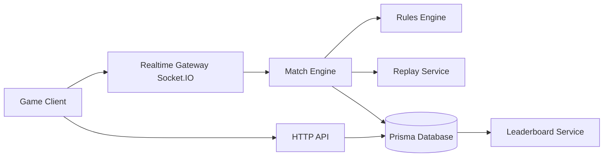
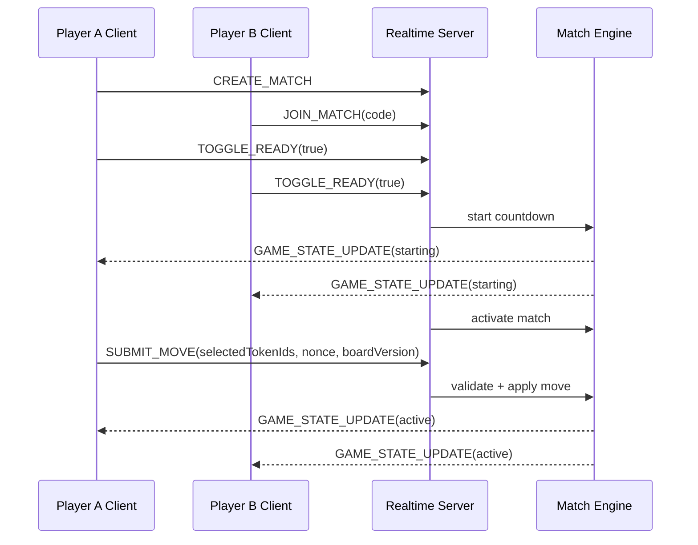
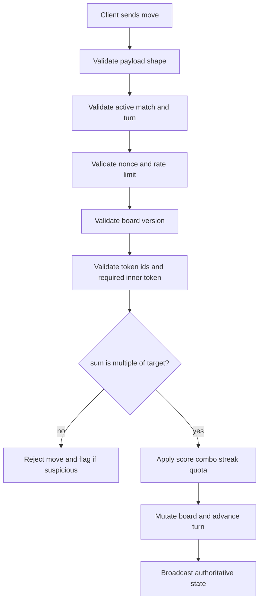
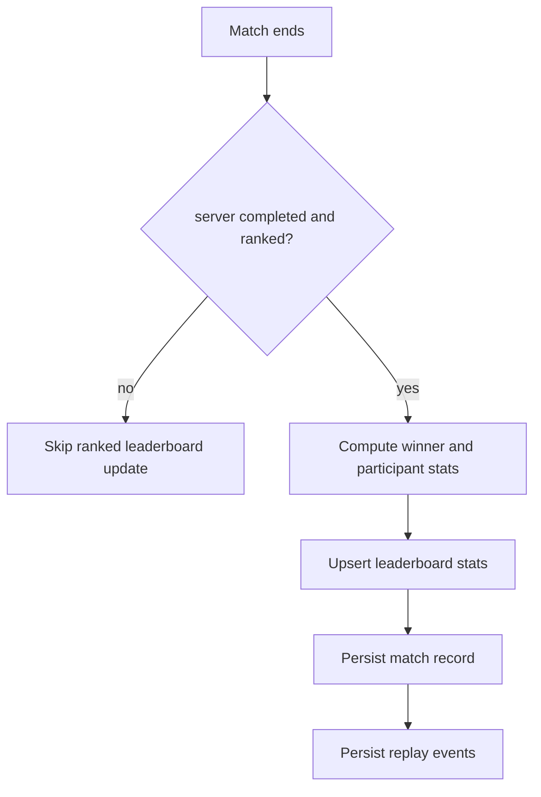

# Celestial Break

Celestial Break is an original multiplayer competitive number puzzle game inspired by the broad concept of token selection and multiple matching. This project does not include Final Fantasy assets, names, characters, music, iconography, screenshots, or proprietary terminology.

## Game Overview

Players compete by selecting numbered tokens to form valid Break moves:

- The board has a central target number from 1 to 9.
- Each move must include at least one inner token.
- Selected token values must sum to a positive multiple of the target number.
- Valid Break moves grant score, combo, streak, and quota progress.
- The server authoritatively validates all moves, timing, scoring, and outcomes.

## Core Rules

- Target number range: 1 to 9.
- Token values: 1 to 9.
- Inner tokens: required zone; at least one must be selected.
- Outer tokens: optional selection.
- Invalid move: rejected by server; does not advance trusted scoring.
- Match win condition:
  - first to quota, or
  - highest score when turn limit ends.

## Match Settings

Supported settings:

- `turnLimit`
- `secondsPerTurn`
- `quotaToWin`
- `targetNumberRange`
- `boardSize`
- `maxPlayers`
- `ranked`
- `tokenReplacementMode`
- `comboRules`

## Multiplayer Lifecycle

Match states:

- `waiting`
- `starting`
- `active`
- `completed`
- `abandoned`

Features:

- Create match
- Join match by code
- Quick queue placeholder
- Ready state and countdown
- Real-time board sync via Socket.IO
- Server turn timer authority
- Reconnect support by persisted player id
- Rematch request
- Bot practice mode (easy, normal, hard)

## Anti-Cheat Model

The server is authoritative for:

- RNG and board generation
- target number updates
- move validation
- score and combo calculations
- turn timing
- winner determination
- ranked leaderboard writes

Implemented protections:

- per-player move rate limiting
- duplicate nonce rejection
- stale board version rejection
- inactive-player rejection
- turn-window validation
- unknown token id rejection
- suspicious activity flags for:
  - request flooding
  - duplicate nonce spam
  - disconnect abuse
  - stale board misuse
- replay event log per match for audit

## Leaderboards

Tracked stats include:

- rating
- wins
- losses
- win rate
- best score
- best combo
- best streak
- fastest valid Break
- weekly ranked scores
- all-time ranked scores

Rules:

- only server-completed ranked matches update ranked leaderboard stats
- casual matches do not affect ranked leaderboard standings

## Tech Stack

- Frontend: React 18 (Create React App), JavaScript
- Backend: Node.js, Express, Socket.IO
- Persistence: Prisma ORM with SQLite default (`DATABASE_URL`)
- Tests: Jest (server + client)
- Container: Docker and Docker Compose

## Project Structure

```text
.
|-- client/
|   |-- src/screens/
|   |-- src/components/ui/
|   `-- src/state/
|-- server/
|   |-- src/domain/
|   |-- src/services/
|   |-- src/contracts/
|   |-- src/db/
|   `-- prisma/
|-- docs/assets.md
|-- Dockerfile
`-- docker-compose.yml
```

## Installation

### 1) Install dependencies

```bash
cd /home/runner/work/spherebreak/spherebreak/client
npm install

cd /home/runner/work/spherebreak/spherebreak/server
npm install
```

### 2) Configure environment

Create `/home/runner/work/spherebreak/spherebreak/server/.env`:

```env
DATABASE_URL="file:./dev.db"
PORT=3000
NODE_ENV=development
```

### 3) Prepare database

```bash
cd /home/runner/work/spherebreak/spherebreak/server
npm run db:generate
npm run db:push
npm run db:seed
```

## Run Development

Start backend:

```bash
cd /home/runner/work/spherebreak/spherebreak/server
npm run dev
```

Start frontend in another terminal:

```bash
cd /home/runner/work/spherebreak/spherebreak/client
PORT=3001 REACT_APP_SERVER_URL=http://localhost:3000 npm start
```

Open `http://localhost:3001`.

## Run Tests

Server tests:

```bash
cd /home/runner/work/spherebreak/spherebreak/server
npm test
```

Client tests:

```bash
cd /home/runner/work/spherebreak/spherebreak/client
CI=true npm test -- --watch=false
```

Client build:

```bash
cd /home/runner/work/spherebreak/spherebreak/client
npm run build
```

## Docker

```bash
cd /home/runner/work/spherebreak/spherebreak
docker compose up --build
```

## Architecture Diagram



## Multiplayer Sequence



## Move Validation Flow



## Leaderboard Update Flow



## Asset Licensing

See `/home/runner/work/spherebreak/spherebreak/docs/assets.md`.

All included visuals are original SVG assets created for this repository.

## Deployment Notes

- Backend serves built frontend from `client/build`.
- Set `DATABASE_URL` for production database target.
- Keep Socket.IO behind HTTPS-capable reverse proxy.
- Do not expose debug-only internals publicly.
