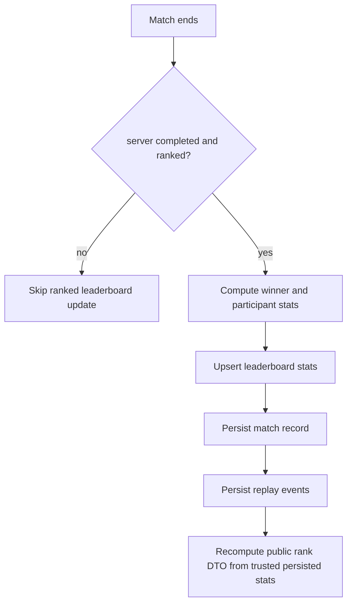
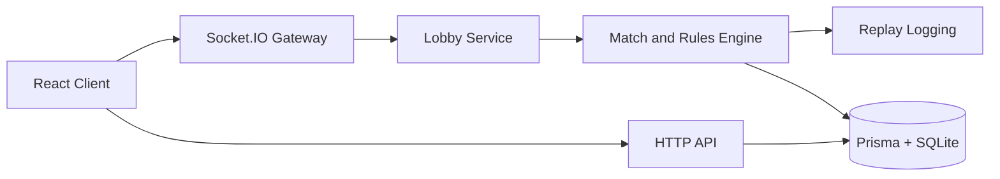

# Celestial Break

Celestial Break is a real-time multiplayer number puzzle game. Players select tokens so the sum is a positive multiple of the current target number. The backend is server-authoritative for match logic, anti-cheat validation, timing, and leaderboard persistence.

This repository contains only original game content and original assets.

## Features

- The board has a central target number from 1 to 9.
- Each move must include at least one inner token.
- Selected token values must sum to a positive multiple of the target number.
- Valid Break moves grant score, combo, streak, and quota progress.
- The server authoritatively validates all moves, timing, scoring, and outcomes.

## Core Rules

- Target number range: 1 to 9.
- Token values: 1 to 9.
- Inner tokens: required zone; at least one must be selected.
- Outer tokens: optional selection.
- Invalid move: rejected by server; does not advance trusted scoring.
- Match win condition:
  - first to quota, or
  - highest score when turn limit ends.

## Match Settings

Supported settings:

- `turnLimit`
- `secondsPerTurn`
- `quotaToWin`
- `targetNumberRange`
- `boardSize`
- `maxPlayers`
- `ranked`
- `tokenReplacementMode`
- `comboRules`

## Multiplayer Lifecycle

Match states:

- `waiting`
- `starting`
- `active`
- `completed`
- `abandoned`

Features:

- Create match
- Join match by code
- Quick queue placeholder
- Ready state and countdown
- Real-time board sync via Socket.IO
- Server turn timer authority
- Reconnect support by persisted player id
- Rematch request
- Bot practice mode (easy, normal, hard)
- Automatic CPU fallback for waiting multiplayer matches after 60 seconds

## Anti-Cheat Model

The server is authoritative for:

- RNG and board generation
- target number updates
- move validation
- score and combo calculations
- turn timing
- winner determination
- ranked leaderboard writes

Implemented protections:

- per-player move rate limiting
- duplicate nonce rejection
- stale board version rejection
- inactive-player rejection
- turn-window validation
- unknown token id rejection
- suspicious activity flags for:
  - request flooding
  - duplicate nonce spam
  - disconnect abuse
  - stale board misuse
- replay event log per match for audit

## Leaderboards

Tracked stats include:

- rating
- wins
- losses
- win rate
- best score
- best combo
- best streak
- fastest valid Break
- weekly ranked scores
- all-time ranked scores

### Celestial rank badges

Spherebreak exposes a server-authored rank badge anywhere player identities appear. The badge is decorative, but the underlying rank DTO is trusted server output and includes the current tier, short code, icon, colors, and progression toward the next tier when applicable.

Current ladder:

- Comet
- Lumen
- Nova
- Astral

High-level formula:

- trusted `LeaderboardStat.rating` is the primary rank input
- if a player has malformed or missing rating data, the server falls back to a deterministic estimate using persisted wins and losses (`1000 + wins*20 - losses*10`)
- fallback promotion is capped below Nova until a player has at least 3 recorded ranked matches, which keeps early data from over-promoting accounts
- top-rank players do not receive next-rank progress fields

Rules:

- only server-completed ranked matches update ranked leaderboard stats
- casual matches do not affect ranked leaderboard standings
- clients cannot write rank or trusted stat fields; socket and HTTP responses always recompute rank server-side
- server-generated CPU opponents use persisted ranked stats when available; otherwise they render with the neutral fallback rank
- rank badges always include text labels and compact non-color cues for accessibility, and long names truncate safely on mobile widths

## Tech Stack

- Frontend: React 18 (Create React App)
- Backend: Node.js, Express, Socket.IO
- Data: Prisma ORM with SQLite (default)
- Tests: Jest (server and client)
- Containers: Docker and Docker Compose

## Repository Layout

```text
.
|-- client/
|   |-- src/
|   |-- public/
|   `-- package.json
|-- server/
|   |-- src/
|   |-- prisma/
|   |-- __tests__/
|   |-- index.js
|   `-- package.json
|-- marketing/
|-- e2e/
|-- docker-compose.yml
|-- Dockerfile
`-- README.md
```

## Prerequisites

- Node.js 20+
- npm 10+
- Docker, if you want to use the container workflow

## Quick Start

Install dependencies:

```bash
npm install --prefix server
npm install --prefix client
```

Create `server/.env`:

```env
DATABASE_URL="file:./prisma/dev.db"
PORT=3000
NODE_ENV=development
```

Initialize the database:

```bash
npm run db:generate --prefix server
npm run db:push --prefix server
npm run db:seed --prefix server
```

Start the backend:

```bash
npm run dev --prefix server
```

Start the frontend in another terminal:

```bash
npm start --prefix client
```

If you want the client dev server to talk to the backend on a different port, set `REACT_APP_SERVER_URL=http://localhost:3000` before starting the client.

## Gameplay Rules

- Token values range from 1 to 9
- The target number range is configurable, with 1 to 9 as the default range
- A valid move must include at least one inner token
- Selected token values must sum to a positive multiple of the target
- Match ends when quota is reached or the turn limit is hit

## Match Lifecycle

States:

- `waiting`
- `starting`
- `active`
- `completed`
- `abandoned`

Behavior:

- Reconnect support by persisted player id
- Ready-check and countdown before match start
- Automatic bot injection after 60 seconds when matchmaking stalls

## Leaderboard and Persistence

Persisted data includes:

- Users and display names
- Leaderboard stats, including rating, wins, losses, win rate, best scores, best combo, best streak, and fastest Break
- Match records and participants
- Replay event logs

Only server-completed ranked matches update ranked leaderboard values.

Live in-progress match state is in memory and is not durable across server restarts.

### Where scores are stored

- Local development: SQLite file from `DATABASE_URL`, usually `server/prisma/dev.db`
- Container deployment: whatever path `DATABASE_URL` points to; use a mounted volume for persistence

## Docker

Run with the current compose file:

```bash
docker compose up --build
```

The included compose file is minimal and exposes port 3000.

Recommended persistent setup for Portainer or other production-like deployments:

```yaml
services:
  spherebreak:
    image: your-registry/spherebreak:latest
    ports:
      - "3000:3000"
    environment:
      - NODE_ENV=production
      - PORT=3000
      - DATABASE_URL=file:/data/dev.db
    volumes:
      - spherebreak-data:/data
    restart: unless-stopped

volumes:
  spherebreak-data:
```

This keeps leaderboard and match history data across image rebuilds and stack updates.

## Portainer Deployment

### First-time deployment

- Build the image on the Docker host that Portainer will use:

```bash
docker compose build
```

- In Portainer, go to **Stacks** → **Add stack**, paste the compose file, and deploy it.

- If you deploy from a registry, tag and push the image first, then point the stack `image:` field at that tag.

### Updating the app

- Rebuild the image after pulling new code.
- Tag and push a new image version if you deploy from a registry.
- Open the stack in Portainer and choose **Update the stack**.

The named volume is left untouched during updates, so persisted leaderboard data remains available.

### Backing up the database

```bash
docker run --rm -v spherebreak-data:/data -v $(pwd):/backup alpine \
  tar czf /backup/spherebreak_backup_$(date +%Y%m%d).tar.gz /data
```

Restore:

```bash
docker run --rm -v spherebreak-data:/data -v $(pwd):/backup alpine \
  tar xzf /backup/spherebreak_backup_YYYYMMDD.tar.gz -C /
```

## Testing

Run the main checks:



Rank DTOs are attached to leaderboard rows, profile responses, open lobby payloads, and live/public player state. Clients render them but never author them.

## CPU Fallback Lifecycle
```bash
npm test --prefix server
npm test --prefix client -- --watch=false
npm run build --prefix client
```

Main server test coverage includes rules engine, match engine, anti-cheat, bots, lobby flow, and leaderboard updates.

## Architecture



## Security Notes

- Server is authoritative for scoring, timing, move validity, and outcomes
- Rate limiting and nonce checks are enforced server-side
- Stale board versions and suspicious activity are flagged
- Do not expose secrets in client-side code or public configs

## Troubleshooting

- If the server warns about missing `DATABASE_URL`, create `server/.env`
- If the client cannot connect in development, verify `REACT_APP_SERVER_URL`
- If data is lost in Docker, mount a volume and make sure `DATABASE_URL` points to that mounted path

## Additional Docs

- Visual assets: `docs/assets.md`
- Marketing static files are served from `marketing/` at `/marketing`
