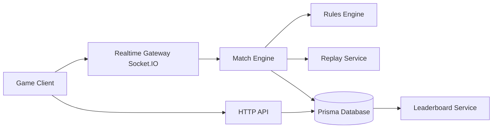
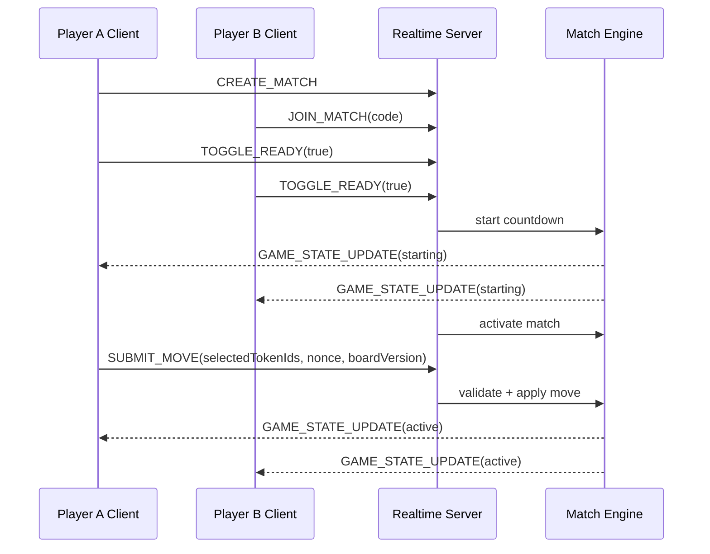
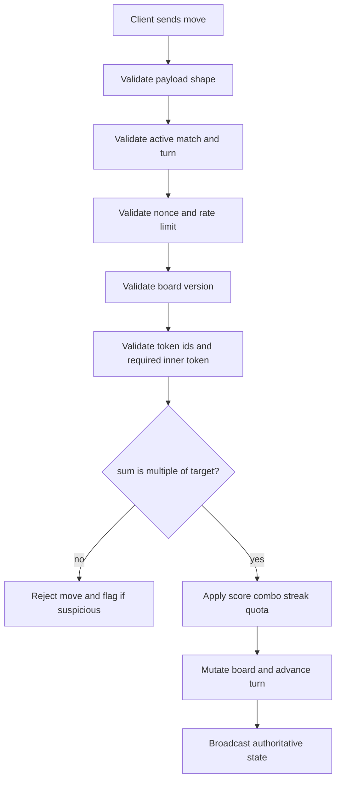
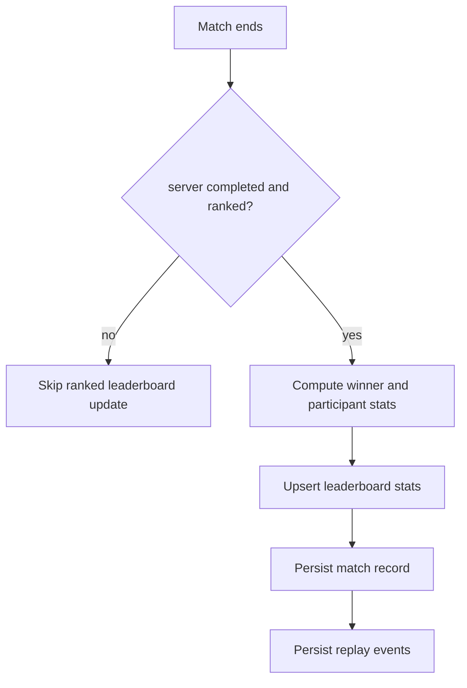
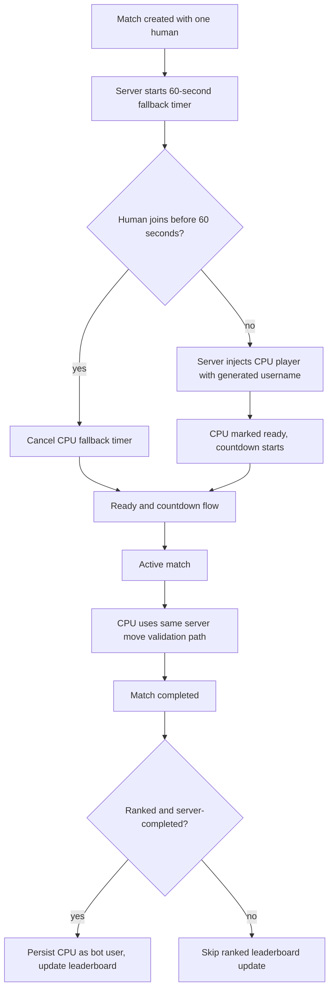

# Celestial Break

Celestial Break is an original multiplayer competitive number puzzle game inspired by the broad concept of token selection and multiple matching. This project does not include Final Fantasy assets, names, characters, music, iconography, screenshots, or proprietary terminology.

## Game Overview

Players compete by selecting numbered tokens to form valid Break moves:

- The board has a central target number from 1 to 9.
- Each move must include at least one inner token.
- Selected token values must sum to a positive multiple of the target number.
- Valid Break moves grant score, combo, streak, and quota progress.
- The server authoritatively validates all moves, timing, scoring, and outcomes.

## Core Rules

- Target number range: 1 to 9.
- Token values: 1 to 9.
- Inner tokens: required zone; at least one must be selected.
- Outer tokens: optional selection.
- Invalid move: rejected by server; does not advance trusted scoring.
- Match win condition:
  - first to quota, or
  - highest score when turn limit ends.

## Match Settings

Supported settings:

- `turnLimit`
- `secondsPerTurn`
- `quotaToWin`
- `targetNumberRange`
- `boardSize`
- `maxPlayers`
- `ranked`
- `tokenReplacementMode`
- `comboRules`

## Multiplayer Lifecycle

Match states:

- `waiting`
- `starting`
- `active`
- `completed`
- `abandoned`

Features:

- Create match
- Join match by code
- Quick queue placeholder
- Ready state and countdown
- Real-time board sync via Socket.IO
- Server turn timer authority
- Reconnect support by persisted player id
- Rematch request
- Bot practice mode (easy, normal, hard)
- Automatic CPU fallback for waiting multiplayer matches after 60 seconds

## Anti-Cheat Model

The server is authoritative for:

- RNG and board generation
- target number updates
- move validation
- score and combo calculations
- turn timing
- winner determination
- ranked leaderboard writes

Implemented protections:

- per-player move rate limiting
- duplicate nonce rejection
- stale board version rejection
- inactive-player rejection
- turn-window validation
- unknown token id rejection
- suspicious activity flags for:
  - request flooding
  - duplicate nonce spam
  - disconnect abuse
  - stale board misuse
- replay event log per match for audit

## Leaderboards

Tracked stats include:

- rating
- wins
- losses
- win rate
- best score
- best combo
- best streak
- fastest valid Break
- weekly ranked scores
- all-time ranked scores

Rules:

- only server-completed ranked matches update ranked leaderboard stats
- casual matches do not affect ranked leaderboard standings
- server-generated CPU opponents are persisted as bot users when ranked matches complete

## Tech Stack

- Frontend: React 18 (Create React App), JavaScript
- Backend: Node.js, Express, Socket.IO
- Persistence: Prisma ORM with SQLite default (`DATABASE_URL`)
- Tests: Jest (server + client)
- Container: Docker and Docker Compose

## Project Structure

```text
.
|-- client/
|   |-- src/screens/
|   |-- src/components/ui/
|   `-- src/state/
|-- server/
|   |-- src/domain/
|   |-- src/services/
|   |-- src/contracts/
|   |-- src/db/
|   `-- prisma/
|-- docs/assets.md
|-- Dockerfile
`-- docker-compose.yml
```

## Installation

### 1) Install dependencies

```bash
cd client
npm install

cd ../server
npm install
```

### 2) Configure environment

Create `server/.env`:

```env
DATABASE_URL="file:./prisma/dev.db"
PORT=3000
NODE_ENV=development
```

### 3) Prepare database

```bash
cd server
npm run db:generate
npm run db:push
npm run db:seed
```

## Run Development

Start backend:

```bash
cd server
npm run dev
```

Start frontend in another terminal:

```bash
cd client
PORT=3001 REACT_APP_SERVER_URL=http://localhost:3000 npm start
```

Open `http://localhost:3001`.

Marketing site:

- static files live in `marketing/`
- production server route: `http://localhost:3000/marketing/`
- primary play CTA points to `/`, which is the served game client route

## Run Tests

Server tests:

```bash
cd server
npm test
```

Client tests:

```bash
cd client
CI=true npm test -- --watch=false
```

Client build:

```bash
cd client
npm run build
```

### Test coverage

Server test suites:

- `gameEngine.test.js` - rules engine: board creation, move validation, board mutation, valid move enumeration, scoring
- `__tests__/rulesEngine.test.js` - validateMoveInput edge cases, calculateSelection, createBoard, applyBoardMutation, enumerateValidMoves
- `__tests__/matchEngine.test.js` - valid/invalid move handling, score/combo/streak/quota updates, match completion (quota and turn limit), winner determination, turn timeouts, addPlayer full/reconnect behaviour, getPublicState shape
- `__tests__/antiCheat.test.js` - duplicate nonce rejection, rate limit flooding
- `__tests__/botEngine.test.js` - bot move selection validity
- `__tests__/lobbyService.test.js` - stale board rejection, inactive player rejection, duplicate nonce via lobby, CPU fallback timing, fallback cancellation, no-duplicate fallback, fallback lifecycle, bot turn pipeline, reconnect behaviour, reconnect no-duplicate, rematch fresh state, race condition
- `__tests__/leaderboardService.test.js` - ranked match with CPU updates leaderboard, casual match does not, abandoned match does not

## Docker

```bash
docker compose up --build
```

## Portainer Deployment

### Persistent storage

All leaderboard, match history, and player stats are stored in a SQLite database at `/app/data/spherebreak.db` inside a Docker named volume (`spherebreak_data`). This volume survives container restarts, image rebuilds, and stack redeployments.

**What is persisted** (in the named volume):
- User accounts and display names
- Leaderboard stats (rating, wins, losses, win rate, best scores, best combo, best streak, fastest break)
- Match records and participants
- Replay event logs

**What is NOT persisted** (in-memory only):
- Active match state (boards, current scores, timers, player sockets)
- Quick queue state
- CPU fallback timers

Any match that is in progress when the container stops will be lost. Players can start a new match after a redeploy. Completed ranked matches are already written to the database and are safe.

### First-time Portainer stack deployment

1. Build the image on your Docker host:
   ```bash
   docker compose build
   ```
   This creates the `spherebreak:latest` image locally.

2. In Portainer, go to **Stacks → Add stack**.

3. Paste the contents of `docker-compose.yml` into the web editor (or point Portainer at the repository).

4. Click **Deploy the stack**.

Portainer will start the container. On the first boot the entrypoint initialises the database schema automatically. The app is available on port `3000`.

### Updating the app

1. Pull or checkout the new code on your Docker host.

2. Rebuild the image:
   ```bash
   docker compose build
   # Optionally tag and push to a registry:
   # docker tag spherebreak:latest yourregistry/spherebreak:v1.2.3
   # docker push yourregistry/spherebreak:v1.2.3
   ```

3. In Portainer, open the stack and click **Update the stack**.

The named volume is untouched during the update. The entrypoint re-runs `prisma db push` on startup to apply any schema changes safely.

> **Active games**: any match in progress at deploy time will be interrupted. Players will be disconnected and must start a new match. Completed games are safe in the database.

### Backing up the database

```bash
docker run --rm -v spherebreak_data:/data -v $(pwd):/backup alpine \
  tar czf /backup/spherebreak_backup_$(date +%Y%m%d).tar.gz /data
```

Restore:

```bash
docker run --rm -v spherebreak_data:/data -v $(pwd):/backup alpine \
  tar xzf /backup/spherebreak_backup_YYYYMMDD.tar.gz -C /
```

## Architecture Diagram



## Multiplayer Sequence



## Move Validation Flow



## Leaderboard Update Flow



## CPU Fallback Lifecycle

When a multiplayer match has one human and no bot after creation, the server starts a 60-second timer. If no second human joins, a CPU opponent is automatically added.



## Anti-Cheat Assumptions

- The server is the only trusted authority for RNG, scoring, timing, and winner determination.
- Clients receive authoritative state via GAME_STATE_UPDATE and must not act on self-reported score.
- Move nonces are per-player-per-match and expire after 300 entries to prevent replay attacks.
- Rate limiting is set to 30 move events per 4-second window per player.
- Stale board version submissions are flagged as suspicious.
- Disconnect abuse (more than 2 rapid disconnects during an active match) is flagged.

## Known Limitations

- Quick queue is a simple two-player pairing. No persistent queue or ranked matchmaking rating bracket.
- Weekly leaderboard computes from MatchParticipant records. Participants must have at least one ranked match in the last 7 days to appear.
- The replay event log is capped at 500 events per match in memory.
- No end-to-end browser test framework is included. UI playtesting is manual.


See `docs/assets.md`.

All included visuals are original SVG assets created for this repository.

## Deployment Notes

- Backend serves built frontend from `client/build`.
- Set `DATABASE_URL` for production database target.
- Keep Socket.IO behind HTTPS-capable reverse proxy.
- Do not expose debug-only internals publicly.
