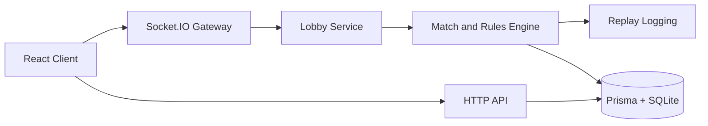

# Celestial Break

Celestial Break is a real-time multiplayer number puzzle game. Players select tokens so the sum is a positive multiple of the current target number. The backend is server-authoritative for match logic, anti-cheat validation, timing, and leaderboard persistence.

This repository contains only original game content and original assets.

## Features

- Real-time multiplayer gameplay over Socket.IO
- Ranked and casual match modes
- Bot opponents with automatic CPU fallback
- Server-side move validation and anti-cheat checks
- Persistent leaderboard data with Prisma + SQLite
- React client served by Express in production

## Tech Stack

- Frontend: React 18 (Create React App)
- Backend: Node.js, Express, Socket.IO
- Data: Prisma ORM with SQLite (default)
- Tests: Jest (server and client)
- Containers: Docker and Docker Compose

## Repository Layout

```text
.
|-- client/
|   |-- src/
|   |-- public/
|   `-- package.json
|-- server/
|   |-- src/
|   |-- prisma/
|   |-- __tests__/
|   |-- index.js
|   `-- package.json
|-- marketing/
|-- e2e/
|-- docker-compose.yml
|-- Dockerfile
`-- README.md
```

## Prerequisites

- Node.js 20+
- npm 10+
- Docker (optional)

## Quick Start (Local Development)

1. Install dependencies

```bash
npm install --prefix server
npm install --prefix client
```

1. Create environment file at `server/.env`

```env
DATABASE_URL="file:./prisma/dev.db"
PORT=3000
NODE_ENV=development
```

1. Initialize database

```bash
npm run db:generate --prefix server
npm run db:push --prefix server
npm run db:seed --prefix server
```

1. Start backend

```bash
npm run dev --prefix server
```

1. Start frontend (new terminal)

```bash
npm start --prefix client
```

By default:

- Frontend: <http://localhost:3000> (if served by backend build) or <http://localhost:3001> (CRA dev server)
- Backend API: <http://localhost:3000/api>

If you run the client dev server on port 3001, set `REACT_APP_SERVER_URL=http://localhost:3000` in the client environment.

## Scripts

### Server scripts

- `npm run dev --prefix server`: start server with nodemon
- `npm start --prefix server`: start server in normal mode
- `npm test --prefix server`: run backend tests
- `npm run db:generate --prefix server`: generate Prisma client
- `npm run db:push --prefix server`: apply Prisma schema to database
- `npm run db:seed --prefix server`: seed initial data

### Client scripts

- `npm start --prefix client`: run CRA dev server
- `npm run build --prefix client`: build production client
- `npm test --prefix client`: run frontend tests

## Gameplay Rules

- Token values range from 1 to 9
- The target number range is configurable (default 1 to 9)
- A valid move must include at least one inner token
- Selected token values must sum to a positive multiple of target
- Match ends when quota is reached or turn limit is hit

## Match Lifecycle

States:

- `waiting`
- `starting`
- `active`
- `completed`
- `abandoned`

Key behavior:

- Reconnect support by persisted player id
- Ready-check and countdown before match start
- Automatic bot injection after 60 seconds when matchmaking stalls

## Leaderboard and Persistence

Persisted data includes:

- Users and leaderboard stats
- Match and participant records
- Replay events

Only server-completed ranked matches update ranked leaderboard values.

### Where scores are stored

- Local development: SQLite file from `DATABASE_URL` (default `server/prisma/dev.db`)
- Container deployment: wherever `DATABASE_URL` points; use a mounted volume for persistence

Important: live in-progress match state is in memory and is not durable across server restarts.

## Docker

### Run with current compose file

```bash
docker compose up --build
```

The included compose file is minimal and exposes port 3000.

### Recommended persistent setup (Portainer/production-like)

Use a volume and explicit database path, for example:

```yaml
services:
    spherebreak:
        image: your-registry/spherebreak:latest
        ports:
            - "3000:3000"
        environment:
            - NODE_ENV=production
            - PORT=3000
            - DATABASE_URL=file:/data/dev.db
        volumes:
            - spherebreak-data:/data
        restart: unless-stopped

volumes:
    spherebreak-data:
```

This ensures leaderboard and match history survive container updates.

## Testing

Run all major checks:

```bash
npm test --prefix server
npm test --prefix client -- --watch=false
npm run build --prefix client
```

Main server test coverage includes rules engine, match engine, anti-cheat, bots, lobby flow, and leaderboard updates.

## Architecture



## Security Notes

- Server is authoritative for scoring, timing, move validity, and outcomes
- Rate limiting and nonce checks are enforced server-side
- Stale board versions and suspicious activity are flagged
- Do not expose secrets in client-side code or public configs

## Troubleshooting

- If server warns about missing `DATABASE_URL`, create `server/.env`
- If client cannot connect in development, verify `REACT_APP_SERVER_URL`
- If data is lost in Docker, mount a volume and set `DATABASE_URL` to that path

## Additional Docs

- Visual assets: `docs/assets.md`
- Marketing static files are served from `marketing/` at `/marketing`
